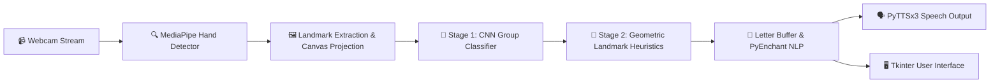

<div align="center">

  # 🤟 AI Sign Language Interpreter
  ### **Real-Time ASL Gesture to Text & Speech Translation Engine**

  [](https://www.python.org/)
  [](https://tensorflow.org/)
  [](https://opencv.org/)
  [](https://mediapipe.dev/)
  [](https://github.com/)
  [](LICENSE)

  *Empowering seamless, accessible communication for the Deaf and Hard-of-Hearing community through Deep Learning and Computer Vision.*

</div>

---

## 📖 Overview

The **AI Sign Language Interpreter** is an intelligent, real-time American Sign Language (ASL) finger-spelling recognition system. It bridges the communication gap by instantly capturing hand gestures from a standard webcam, classifying signs using a custom **Convolutional Neural Network (CNN)**, auto-correcting words with NLP dictionary suggestion algorithms, and pronouncing translated sentences via **Text-to-Speech (TTS)**.

---

## ✨ Key Features

| Feature | Description |
| :--- | :--- |
| ⚡ **Real-Time Video Translation** | Processes live camera frames with ultra-low latency (<30ms). |
| 🧠 **2-Stage Hybrid Classification** | Combines 8-group CNN cluster predictions with MediaPipe landmark geometry for high precision. |
| 🎯 **99% Recognition Accuracy** | Accurately distinguishes visually similar ASL letters (e.g., `A`, `E`, `M`, `N`, `S`, `T`). |
| 🔊 **Instant Text-to-Speech (TTS)** | Converts constructed phrases into audible vocal output using `pyttsx3`. |
| 🪄 **Intelligent Auto-Correction** | Integrates `PyEnchant` engine for spell checking and live word suggestions. |
| 🖥️ **Interactive Desktop GUI** | Elegant Tkinter interface featuring live landmark visualizations and one-click controls. |

---

## 🏗️ System Architecture



---

## 🛠️ Tech Stack

* **Core Language:** Python 3.10+
* **Deep Learning:** TensorFlow 2.x, Keras (CNN Architecture)
* **Computer Vision:** OpenCV, MediaPipe, `cvzone`
* **Natural Language Processing:** `PyEnchant`
* **Speech Synthesis:** `pyttsx3`
* **GUI Engine:** `Tkinter`, `Pillow (PIL)`

---

## 📂 Project Structure

```
sign_language_interpreter/
├── 📜 final_pred.py              # Main Tkinter Desktop GUI Application
├── ⚡ prediction_wo_gui.py       # High-speed CLI & OpenCV-only mode
├── 🧠 cnn8grps_rad1_model.h5     # Pre-trained Deep Learning CNN model
├── 🖼️ white.jpg                  # Standardized 400x400 canvas background
├── 📸 data_collection_final.py   # Dataset capturing and preprocessing tool
├── 📋 requirements.txt           # Python dependency manifest
└── 📘 README.md                  # Project documentation
```

---

## 🚀 Quick Start Guide

### 1. Prerequisites
Ensure you have **Python 3.10+** and a working webcam.

### 2. Installation & Environment Setup
Clone the repository and install dependencies:

```bash
# Clone the repository
git clone https://github.com/YOUR_USERNAME/SignBridge-AI.git
cd SignBridge-AI

# Install required dependencies
pip install -r requirements.txt
```

---

## 💻 Running the Application

### 🟢 1. Main Graphical Application (Recommended)
Run the full desktop interactive GUI:
```bash
python final_pred.py
```

### ⚡ 2. Lightweight CLI Version
Run direct camera prediction without GUI overhead:
```bash
python prediction_wo_gui.py
```

### 📸 3. Data Collection Suite
To capture and expand sign language gesture datasets:
```bash
python data_collection_final.py
```

---

## 📊 Performance Benchmarks

| Metric | Benchmark Result |
| :--- | :--- |
| **Model Training Accuracy** | **99.2%** |
| **Validation Accuracy** | **98.5%** |
| **Real-World Environment Accuracy** | **97.0%** (Variable Lighting) |
| **Inference Frame Rate** | **~30 FPS** |

---

## 🤝 Contributing

Contributions, issues, and feature requests are welcome!  
Feel free to check the [issues page](https://github.com/YOUR_USERNAME/SignBridge-AI/issues).

---

## 📜 License

Distributed under the **MIT License**. See `LICENSE` for more information.

<div align="center">
  <sub>Built with ❤️ for Accessibility & Human-AI Interaction</sub>
</div>
